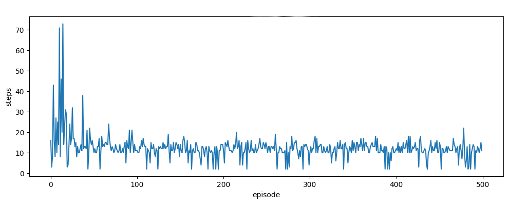
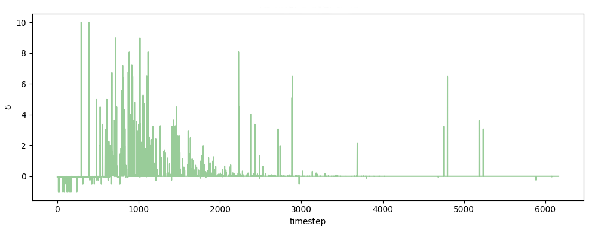
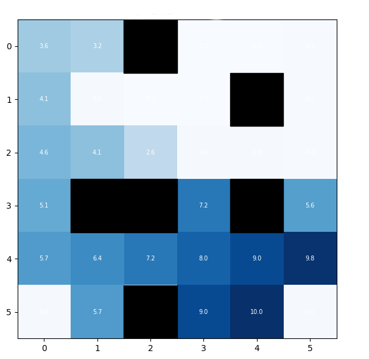
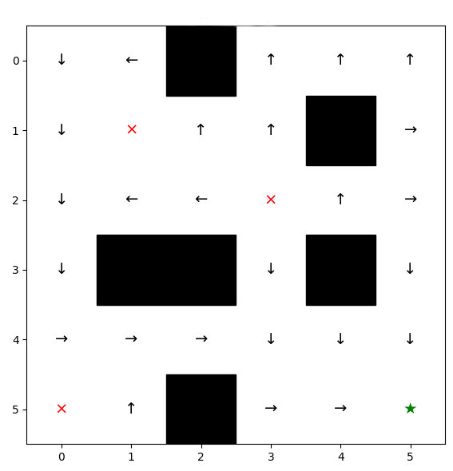

# Introduction
<<<<<<< HEAD

=======
>>>>>>> 3c7e554 (spacing fixes + sectioning)
## History of Reinforcement learning
Reinforcement learning is a framework, built for understanding how automated agents optimize decision processing actions through interaction of their environment. The development of this process reflects decades of converging ideas that stem from early behavioural psychology research, computational theory, computational neuroscience and machine learning, cultivated to reflect automated learning by reward and predications. Over the years, reinforcement learning has evolved from the basis of theoretical psychology principles into a mathematically driven and biologically grounded paradigm. Today, becoming a widely renown algorithmic method used in central field to study brain function and training artificial intelligence (Sutton & Barto, 2020).

### Early Foundations in Psychology
<<<<<<< HEAD
The foundation of reinforcement learning in machine learning can be traced back to the early work of behavioural psychology. Behaviourist Edward Thordike (1911) is often accredited for his work with animal learning and research on learning through trial-and-error learning; where he observed how cats, placed in puzzle boxes show improved escaping performance each time they were repeated placed back into the box. Thorndike proposed the Law of Effect, which suggests that behaviours followed by feelings of satisfaction were more likely to be repeated (Thorndike, 1898; Sutton & Barto, 2020).  This principle was further elaborated upon by behaviorist B.F. Skinner, whose theory of operant conditioning emphasized a systematic role of reinforcement and punishment conditions in shaping behaviour (Skinner, 1938). At this time, research was categorically more descriptive and lacked specificity to how they processed occurred. However, their research had introduced the overall premise that learning is driven by feedback contingencies.

### Early Computational and Theoretical Developments
By the mid-twentieth century, reinforcement learning became more formally defined with the introduction of computational models of decision making. Richard Bellman and fellow colleagues’ work on dynamic programming provided various ways to describe how optimal decision can be made by considering future outcomes (predictions) (Bellman, 1957; Sutton & Barto, 2020). His formulation of the Bellman equation offered a way to evaluate actions based on long-term consequences. 

With the development of the Bellman equation, Bellman and Ronald Howard found that the equation and dynamic programming needed to be utilized under a singular method, introducing the Markov Decision Process (MDP). This mathematical process offered a formal structure to describe situations where decisions are made step by step over time, while also allowing the application of dynamic programming such as policy iteration and value iteration (Sutton & Barto, 2020; Suf, 2025). These early formulations and elements became underlying functions to what would later become reinforcement learning.

Around this time, early models of machine learning were developing in neuroscience and psychology. The work of Arthur Samual, often considered one of the first examples of machine learning, created a checkers program that improved with experiences (Samual, 1959).  

Furthermore, shortly after the work of Donald Hebb in 1949, when he proposed that connections between neurons strengthens when they are activated together (Hebb, 1949), Bruse Farley and Wesley Clark developed one of the earliest computational models of learning using artificial neural networks (Farley & Clark, 1954) however, their shift away from trail-and-error learning created confusion on the distinction between what would later be reinforcement learning and supervised learning . As such in the 1960s and 1970s, research around trial-and-error learning became limited (Sutton & Barto, 2020).  With some notable exceptions such as John Andreae (1963) STeLLA system and coined the term “learning from a teacher,” and Donald Michie (1961, 1963) use of trial-and-error system to learning tic-tac-toe (Sutton & Barto, 2020). 

### Temporal Difference and Dopamine 
Prediction errors, defined as the difference between expected and unexpected outcomes, involved with the learning process became another major influence towards reinforcement learning. Richard Sutton developed of temporal difference (TD) learning, where predictions are updated gradually over time and allowed continuous learning (Sutton, 1988). In TD learning, predictions are updated step by step using small error that occur each moment. This allows an agent to adjust its expectations and subsequentially its actions, making learning more flexible. This became important when neuroscience research observed similar behaviours in the brain to how the prediction error was used in TD learning. 

Neuroscience studies showed that dopamine neurons respond in ways that closely match prediction errors (Schultz et al., 1997). For example, some studies showed increase activity of dopamine neurons for unexpected rewards, decrease activity when expected rewards were omitted (getting an undesired outcome) and a shift in activity as the cues for the reward becomes more predictable (Schultz et al., 1997; Mirenowicz & Schultz, 1994; Bayer & Glimcher, 2005). Further evidence in humans showed that the dopamine-related signals help updated the value of actions and guide decision-making (Pessiglione et al., 2006). Together these findings suggested that the in the brain may use a similar process to TD learning to adjust behaviour. 

Closely related to this was the development of actor-critic models.  A paper from Widrow, Gupta, and Maita (1973) would publish a modified algorithm of Widrow and Hoff’s Least-Mean-Square (LMS) to produce a new form of reinforcement learning principle, “selective bootstrap adaptation,” that introduced “learning from a critic” (Sutton & Barto, 2015). In this framework, one part of the system selects actions, while another evaluates said actions by value estimate. The critic generates a prediction error signal, which is used to update both components over time. What makes this unique to the previous “learning from a teacher,” is that the critic does not need know the outcome to make these predictions, providing a similar pattern of simulation to dopamine neurons (Schultz et al., 1997; Bayer & Glimcher, 2005; Sutton & Barto, 2020).

### Reinforcement Learning in Machine Learning
As reinforcement learning became more widely used in computer science, many algorithms developed that could learn directly from experience. One of the most significant algorithms developed was Christopher Watkins’ Q-learning, later formalized with Peter Dayan (Watkins & Dayan, 1992). Q-learning built on earlier work in dynamic programming, temporal difference learning, and the MDP framework, as before then, dynamic programming was used to find the optimal solution in MDP. However, the issue with this was that dynamic programming struggled with large pre-set search spaces to find the optimal solution. Q-learning removed this limitation because rather than requiring knowledge about how the environment works, it allows an agent to learn the value of actions through trial-and-error. In Q-learning, the agent learns Q-values, which represent hoe well a particular action is in a given situation. These values are than updated overt time using prediction errors (Sutton, 1997; Sutton & Barto, 2020; Suf, 2025).

Historically, Q-learning marked a shift toward more flexible and practical reinforcement learning method. It became widely used in the 1990s and early 2000s is fields such as robotics and game play development. Robert Sutton and Andrew Barto also helped bring many of these ideas into a general framework for reinforcement learning (Sutton & Barto, 2020; Suf, 2025).

### Modern expansion of Reinforcement learning Algorithms 
Current Reinforcement learning research has expanded past traditional environments into more complex settings. One major direction involves the collaboration of reinforcement learning with large language models through reinforcement learning from human feedback (RLHF), where systems learn from human preferences rather than fixed rewards (Ouyang et al., 2022). Related work in preference-based reinforcement learning also allows agents to learn from comparisons and subjective judgements instead of explicit numerical outcomes, making learning more flexible (Christiano et al., 2017). Reinforcement learning is also being applied in healthcare, where its used to optimize treatment decisions over time by adapting to patient responses (Gottesman et al., 2019). In robotics and autonomous systems, reinforcement learning continues to be used to as a tool to improve real-work decision-making and motor control, with a focus on making learning more efficient and adaptable (Kober et al., 2013). 

Furthermore, reinforcement learning has advanced quickly with the development of deep learning. Researcher at DeepMind had shown that reinforcement system could learn directly from complex inputs such as images (Mnih et al., 2015).  One well-known example is AlphaGo and its successor AlphaGo Zero, which was able to independently learn the game Go and defeat the world champion Lee Sedol in 2016 (Silver et al., 2016). These developments built directly on earlier method of Q-learning and actor-critic models. 

At the same time, reinforcement learning continues to be studied in psychology and neuroscience, Researchers use reinforcement models to study decision-making, habits, and disorders such as addiction (Glimcher, 2011). With differences between types of learning, such as model-free and model-based learning, have also been linked to different brain systems (Daw et al., 2005).
=======
The foundation of reinforcement learning in machine learning can be traced back to the early work of behavioural psychology.  Behaviourist Edward Thordike (1911) is often accredited for his work with animal learning and research on learning through trial-and-error learning; where he observed how cats, placed in puzzle boxes show improved escaping performance each time they were repeated placed back into the box. Thorndike proposed the Law of Effect, which suggests that behaviours followed by feelings of satisfaction were more likely to be repeated (Thorndike, 1898; Sutton & Barto, 2020).  This principle was further elaborated upon by behaviorist B.F. Skinner, whose theory of operant conditioning emphasized a systematic role of reinforcement and punishment conditions in shaping behaviour (Skinner, 1938). At this time, research was categorically more descriptive and lacked specificity to how they processed occurred. However, their research had introduced the overall premise that learning is driven by feedback contingencies.
### Early Computational and Theoretical Developments
By the mid-twentieth century, reinforcement learning became more formally defined with the introduction of computational models of decision making. Richard Bellman and fellow colleagues’ work on dynamic programming provided various ways to describe how optimal decision can be made by considering future outcomes (predictions) (Bellman, 1957; Sutton & Barto, 2020). His formulation of the Bellman equation offered a way to evaluate actions based on long-term consequences. With the development of the Bellman equation, Bellman and Ronald Howard found that the equation and dynamic programming needed to be utilized under a singular method, introducing the Markov Decision Process (MDP). This mathematical process offered a formal structure to describe situations where decisions are made step by step over time, while also allowing the application of dynamic programming such as policy iteration and value iteration (Sutton & Barto, 2020; Suf, 2025). These early formulations and elements became underlying functions to what would later become reinforcement learning.Around this time, early models of machine learning were developing in neuroscience and psychology. The work of Arthur Samual, often considered one of the first examples of machine learning, created a checkers program that improved with experiences (Samual, 1959).  Furthermore, shortly after the work of Donald Hebb in 1949, when he proposed that connections between neurons strengthens when they are activated together (Hebb, 1949), Bruse Farley and Wesley Clark developed one of the earliest computational models of learning using artificial neural networks (Farley & Clark, 1954) however, their shift away from trail-and-error learning created confusion on the distinction between what would later be reinforcement learning and supervised learning . As such in the 1960s and 1970s, research around trial-and-error learning became limited (Sutton & Barto, 2020).  With some notable exceptions such as John Andreae (1963) STeLLA system and coined the term “learning from a teacher,” and Donald Michie (1961, 1963) use of trial-and-error system to learning tic-tac-toe (Sutton & Barto, 2020). 

### Temporal Difference and Dopamine Prediction errors
 This is defined as the difference between expected and unexpected outcomes, involved with the learning process became another major influence towards reinforcement learning. Richard Sutton developed of temporal difference (TD) learning, where predictions are updated gradually over time and allowed continuous learning (Sutton, 1988). In TD learning, predictions are updated step by step using small error that occur each moment. This allows an agent to adjust its expectations and subsequentially its actions, making learning more flexible. This became important when neuroscience research observed similar behaviours in the brain to how the prediction error was used in TD learning. Neuroscience studies showed that dopamine neurons respond in ways that closely match prediction errors (Schultz et al., 1997). For example, some studies showed increase activity of dopamine neurons for unexpected rewards, decrease activity when expected rewards were omitted (getting an undesired outcome) and a shift in activity as the cues for the reward becomes more predictable (Schultz et al., 1997; Mirenowicz & Schultz, 1994; Bayer & Glimcher, 2005). Further evidence in humans showed that the dopamine-related signals help updated the value of actions and guide decision-making (Pessiglione et al., 2006). Together these findings suggested that the in the brain may use a similar process to TD learning to adjust behaviour. Closely related to this was the development of actor-critic models.  A paper from Widrow, Gupta, and Maita (1973) would publish a modified algorithm of Widrow and Hoff’s Least-Mean-Square (LMS) to produce a new form of reinforcement learning principle, “selective bootstrap adaptation,” that introduced “learning from a critic” (Sutton & Barto, 2015). In this framework, one part of the system selects actions, while another evaluates said actions by value estimate. The critic generates a prediction error signal, which is used to update both components over time. What makes this unique to the previous “learning from a teacher,” is that the critic does not need know the outcome to make these predictions, providing a similar pattern of simulation to dopamine neurons (Schultz et al., 1997; Bayer & Glimcher, 2005; Sutton & Barto, 2020).

### Reinforcement Learning in Machine Learning
As reinforcement learning became more widely used in computer science, many algorithms developed that could learn directly from experience. One of the most significant algorithms developed was Christopher Watkins’ Q-learning, later formalized with Peter Dayan (Watkins & Dayan, 1992). Q-learning built on earlier work in dynamic programming, temporal difference learning, and the MDP framework, as before then, dynamic programming was used to find the optimal solution in MDP. However, the issue with this was that dynamic programming struggled with large pre-set search spaces to find the optimal solution. Q-learning removed this limitation because rather than requiring knowledge about how the environment works, it allows an agent to learn the value of actions through trial-and-error. In Q-learning, the agent learns Q-values, which represent hoe well a particular action is in a given situation. These values are than updated overt time using prediction errors (Sutton, 1997; Sutton & Barto, 2020; Suf, 2025).Historically, Q-learning marked a shift toward more flexible and practical reinforcement learning method. It became widely used in the 1990s and early 2000s is fields such as robotics and game play development. Robert Sutton and Andrew Barto also helped bring many of these ideas into a general framework for reinforcement learning (Sutton & Barto, 2020; Suf, 2025).

### Modern expansion of Reinforcement Learning Algorithms 
Current Reinforcement learning research has expanded past traditional environments into more complex settings. One major direction involves the collaboration of reinforcement learning with large language models through reinforcement learning from human feedback (RLHF), where systems learn from human preferences rather than fixed rewards (Ouyang et al., 2022). Related work in preference-based reinforcement learning also allows agents to learn from comparisons and subjective judgements instead of explicit numerical outcomes, making learning more flexible (Christiano et al., 2017). Reinforcement learning is also being applied in healthcare, where its used to optimize treatment decisions over time by adapting to patient responses (Gottesman et al., 2019). In robotics and autonomous systems, reinforcement learning continues to be used to as a tool to improve real-work decision-making and motor control, with a focus on making learning more efficient and adaptable (Kober et al., 2013). Furthermore, reinforcement learning has advanced quickly with the development of deep learning. Researcher at DeepMind had shown that reinforcement system could learn directly from complex inputs such as images (Mnih et al., 2015).  One well-known example is AlphaGo and its successor AlphaGo Zero, which was able to independently learn the game Go and defeat the world champion Lee Sedol in 2016 (Silver et al., 2016). These developments built directly on earlier method of Q-learning and actor-critic models. At the same time, reinforcement learning continues to be studied in psychology and neuroscience, Researchers use reinforcement models to study decision-making, habits, and disorders such as addiction (Glimcher, 2011). With differences between types of learning, such as model-free and model-based learning, have also been linked to different brain systems (Daw et al., 2005).
>>>>>>> 3c7e554 (spacing fixes + sectioning)

## Importance and Applications

### Motivation of Reinforcement learning 
<<<<<<< HEAD
Motivation refers to the underlying rationale for adopting a system or model, and the specific problems it is designed to address. Reinforcement learning (RL) is motivated by the need to enable systems to learn from experience, adapt to dynamic environments, and make informed decisions without explicit supervision. 

One primary motivation for reinforcement learning is its ability to operate without labeled data. In many real-world scenarios, predefined answers or annotated datasets are unavailable, which makes supervised learning impractical. Instead of relying on examples, reinforcement learning enables systems to learn through interaction with their environment. Agents iteratively refine their behavior to achieve optimal outcomes by receiving rewards for desirable actions and penalties for its actions. 

Reinforcement learning is also essential for functioning in unknown or partially known environments. In such settings, an agent does not possess complete information about its surroundings and must learn through observation and experimentation. This adaptive capability makes RL particularly valuable in complex and uncertain domains, especially where continuous learning and adjustment are required. 

Another key motivation is the need to balance exploration and exploitation. An effective learning agent must explore new actions to discover potentially better solutions while exploiting known strategies that yield favorable results. Exploration supports long-term optimization with short-term risks, whereas exploitation provides immediate and reliable gains. Achieving an optimal balance between the two is critical for maximizing cumulative rewards. 

Finally, reinforcement learning is driven by the necessity of handling sequential decision-making problems. In many applications, decisions are interconnected, with each action influencing future states and outcomes. As a result, choices cannot be evaluated in isolation but must be considered within a broader temporal context. RL provides a structured framework for optimizing such long-term, interdependent decisions. 

Together, these motivations highlight the significance of reinforcement learning as a powerful and versatile approach for solving complex, real-world problems. 

### Importance of Reinforcement learning 
The importance of reinforcement learning lies in its ability to address complex decision-making problems and contribute meaningfully to real-world applications. It explains why RL matters as a foundational approach in artificial intelligence and highlights its impact across diverse domains. 

First, reinforcement learning provides a robust framework for learning through interaction with an environment. Unlike traditional machine learning methods that rely on static datasets, RL enables systems to learn from the consequences of their actions. This process closely mirrors how humans and animals adapt based on rewards and punishments, establishing strong conceptual links with disciplines such as psychology and neuroscience. 

Second, RL enables the development of autonomous decision-making systems capable of acting, learning, and improving without continuous human supervision. These systems adapt dynamically to changing conditions, making reinforcement learning particularly valuable in applications such as robotics, autonomous vehicles, and recommendation systems. Its ability to optimize performance in real time enhances efficiency, personalization, and operational effectiveness. 

Finally, reinforcement learning introduces fundamental concepts that underpin modern artificial intelligence. Core elements such as value functions, policies, and reward signals provide a structured approach to optimizing behavior over time. Through trial-and-error learning, RL systems iteratively refine their strategies, leading to continuous improvement and long-term performance gains. 

Collectively, these contributions underscore the significance of reinforcement learning as a transformative technology that bridges theoretical foundations with practical, real-world innovation. 
=======
Motivation refers to the underlying rationale for adopting a system or model, and the specific problems it is designed to address. Reinforcement learning (RL) is motivated by the need to enable systems to learn from experience, adapt to dynamic environments, and make informed decisions without explicit supervision. One primary motivation for reinforcement learning is its ability to operate without labeled data. In many real-world scenarios, predefined answers or annotated datasets are unavailable, which makes supervised learning impractical. Instead of relying on examples, reinforcement learning enables systems to learn through interaction with their environment. Agents iteratively refine their behavior to achieve optimal outcomes by receiving rewards for desirable actions and penalties for its actions. Reinforcement learning is also essential for functioning in unknown or partially known environments. In such settings, an agent does not possess complete information about its surroundings and must learn through observation and experimentation. This adaptive capability makes RL particularly valuable in complex and uncertain domains, especially where continuous learning and adjustment are required. Another key motivation is the need to balance exploration and exploitation. An effective learning agent must explore new actions to discover potentially better solutions while exploiting known strategies that yield favorable results. Exploration supports long-term optimization with short-term risks, whereas exploitation provides immediate and reliable gains. Achieving an optimal balance between the two is critical for maximizing cumulative rewards. Finally, reinforcement learning is driven by the necessity of handling sequential decision-making problems. In many applications, decisions are interconnected, with each action influencing future states and outcomes. As a result, choices cannot be evaluated in isolation but must be considered within a broader temporal context. RL provides a structured framework for optimizing such long-term, interdependent decisions. Together, these motivations highlight the significance of reinforcement learning as a powerful and versatile approach for solving complex, real-world problems. 

### Importance of Reinforcement learning 
The importance of reinforcement learning lies in its ability to address complex decision-making problems and contribute meaningfully to real-world applications. It explains why RL matters as a foundational approach in artificial intelligence and highlights its impact across diverse domains. First, reinforcement learning provides a robust framework for learning through interaction with an environment. Unlike traditional machine learning methods that rely on static datasets, RL enables systems to learn from the consequences of their actions. This process closely mirrors how humans and animals adapt based on rewards and punishments, establishing strong conceptual links with disciplines such as psychology and neuroscience. Second, RL enables the development of autonomous decision-making systems capable of acting, learning, and improving without continuous human supervision. These systems adapt dynamically to changing conditions, making reinforcement learning particularly valuable in applications such as robotics, autonomous vehicles, and recommendation systems. Its ability to optimize performance in real time enhances efficiency, personalization, and operational effectiveness. Finally, reinforcement learning introduces fundamental concepts that underpin modern artificial intelligence. Core elements such as value functions, policies, and reward signals provide a structured approach to optimizing behavior over time. Through trial-and-error learning, RL systems iteratively refine their strategies, leading to continuous improvement and long-term performance gains. Collectively, these contributions underscore the significance of reinforcement learning as a transformative technology that bridges theoretical foundations with practical, real-world innovation. 
>>>>>>> 3c7e554 (spacing fixes + sectioning)

### Applications
Reinforcement learning has been successfully applied to a wide range of domains. Sutton and Barto (2020) explain that an agent learns to interact with an environment through trial and error, in order to achieve long-term goals under uncertainty. The agent’s actions influence both immediate outcomes and future states, requiring decisions that account for delayed consequences and involve planning. At the same time, because outcomes are uncertain, the agent must continuously monitor the environment and adjust its behaviour. Over time, the agent improves its performance through experience, updating its decision-making strategies (Sutton & Barto, 2020).

Robotics is one of the most widely studied domains of reinforcement learning, with applications in manufacturing, logistics, healthcare, and space (Li, 2019). Reinforcement learning enables robots to learn complex sequential behaviors through interaction with their environment, making it well-suited for tasks that involve uncertainty and dynamic conditions (Li, 2019). According to Kober et al. (2013), representations, prior knowledge, and approximate models are fundamental components in robotics. Representations refer to state-action discretization, function approximation, and pre-structured policies, and they aim to make complex reinforcement learning problems tractable. Prior knowledge is crucial in guiding the learning process and improving efficiency, including initial policies, demonstration, task structuring, and constraints on actions or policies. Approximate models also improve learning efficiency by enabling simulation and prediction of environment dynamics (Kober et al., 2013). However, Li (2019) states that discrepancies between simulation and the real world, referred to as the sim-to-real gap, might be a challenge. It could be addressed by improving the simulator or designing policies such as randomization in dynamics, observations, and environmental conditions (Li, 2019). In addition, Akalin and Loutfi (2021) explain that the development of social robots has introduced new forms of reward mechanisms. In interactive reinforcement learning, robots learn from human feedback, which may be explicit (e.g., ratings or labels) or implicit (e.g., gestures, speech, or emotional cues).

Reinforcement learning enables self-driving cars to learn optimal driving policies by rewarding desired driving behaviors and penalizing errors, allowing agents to learn through trial and error and ultimately reach the destination (Sivamayil et al., 2023). According to Badue et al. (2021), the self-driving system is typically divided into the perception system and the decision-making system. The perception system is responsible for interpreting data from sensors such as cameras, Light Detection and Ranging (LIDAR), Radio Detection and Ranging (RADAR) and the Global Positioning System (GPS) to form a representation of the environment. It involves road mapping, vehicle localization, and the detection of static and dynamic obstacles. The decision-making system uses this information to determine appropriate actions for the vehicle. It considers the current state of the vehicle, the environment, and constraints such as traffic regulations, and performs route planning, path planning, obstacle avoidance and vehicle control (Badue et al., 2021).

Recommender systems aim to predict user preferences for products and services, to reduce information overload (Li, 2019). They personalize user experience by understanding and analyzing user behaviour, preferences, and interaction patterns, such as satisfaction, interests, and engagement (Li, 2019). Afsar et al. (2023) state that in traditional recommendation systems, collaborative filtering methods use patterns of user interactions to identify similarities between users or items, whereas content-based filtering relies on item features and user profiles to match users with relevant content. Modeling the recommendation systems as a sequential decision-making process can better reflect the user-system interaction (Afsar et al., 2023). It is modeled as a Markov decision process (MDP) and uses reinforcement learning algorithms. Reinforcement learning is suited for recommendation systems because it constantly updates its policy based on rewards and accounts for long-term rewards. For recommendation systems, it learns from the user-system interaction, receives feedback as rewards, and maximizes long-term user engagement, satisfaction, and revenue (Afsar et al., 2023).


# Mathematical Theory

## Markov Decision Process

The Markov Decision Process (MDP) forms the mathematical foundation of reinforcement learning algorithms (Sutton & Barto, 2020). It provides a framework for modeling sequential decision-making problems in stochastic environments (White & White, 1989), where an agent’s actions influence both immediate rewards and subsequent states. These systems satisfy the Markov property, meaning that the state transition and reward depend only on the current state and action, regardless of the prior process (Sutton & Barto, 2020).

According to Sutton and Barto (2020), a MDP is defined by states, actions and rewards, which together describe the interaction between an agent and its environment. The set of all possible states is denoted by $\mathcal{S}$, where each state $S_t$ represents specific coordinates or conditions of the environment at time step $t$. The agent observes the current state $S_t$ and selects an action $A_t$, where $\mathcal{A}(s)$ denotes the set of available actions in that state (Sutton & Barto, 2020). 

After taking action $A_t$, the agent transitions to a new state $S_{t+1}$ based on the state transition probability, which represents the likelihood of transitioning to a subsequent state $S'$ given the current state-action pair (Sutton & Barto, 2020):
$$
P(S' \mid s, a) = \Pr(S_{t+1} = S' \mid S_t = s, A_t = a)
$$
Simultaneously, the agent receives an expected immediate reward $R(s, a)$, which is defined as the expected reward received after taking action $A_t$ in state $S_t$ (Sutton & Barto, 2020):
$$
R(s,a) = \mathbb{E}\left[ R_{t+1} \mid S_t = s, A_t = a \right]
$$

## Policy and Value Function

A policy, denoted as $\pi$, specifies the agent’s behaviour by defining how actions are selected in each state, and $\pi(a \mid s) = \Pr(A_t = a \mid S_t = s)$ represents the probability that the agent selects action $a$ when in state $s$ (Sutton & Barto, 2020). The state-value function, $v_\pi(s)$, defines the expected cumulative reward received when the agent starts in state $s$ and follows policy $\pi$ (Sutton & Barto, 2020). It is defined as :
$$
v_\pi(s) = \mathbb{E}_\pi \left[ \sum_{k=0}^{\infty} \gamma^k R_{t+k+1} \,\middle|\, S_t = s \right]
$$
where $\gamma \in [0, 1]$ is the discount factor, and balances immediate reward and the long-term reward. A smaller $\gamma$ gives more weight to immediate rewards, while a $\gamma$ closer to 1 gives more weight to long-term rewards.

To evaluate the value of specific actions taken in a state, we use the action-value function (or Q-function), $q_\pi(s,a)$ (Sutton & Barto, 2020). This function measures the expected cumulative reward when the agent starts in state $s$, takes action $a$, and follows policy $\pi$:
$$
q_\pi(s,a) = \mathbb{E}_\pi \left[ \sum_{k=0}^{\infty} \gamma^k R_{t+k+1} \,\middle|\, S_t = s, A_t = a \right]
$$

## Bellman Equation
According to Sutton and Barto (2020), the Bellman equation for $v_\pi$ shows a recursive relationship between the value of a state and the values of subsequent states. It describes the value of a state as the sum of the expected immediate reward and the discounted value of subsequent states. For any policy $\pi$, the state-value function satisfies:
$$
v_\pi(s) = \sum_a \pi(a \mid s) \sum_{s',r} p(s',r \mid s,a)\left[ r + \gamma v_\pi(s') \right]
$$
The Bellman optimality equation can be expressed without reference to a specific policy $\pi$, instead selecting the best possible action (Sutton & Barto, 2020). The Bellman optimality equation for the optimal state-value function is:
$$
v^*(s) = \max_{a \in \mathcal{A}(s)} \sum_{s',r} p(s',r \mid s,a)\left[ r + \gamma v^*(s') \right]
$$
It states that the optimal value of a state is the maximum expected total reward achievable by choosing the best action and assuming optimal behaviour in subsequent states.
The Bellman optimality equation for the optimal action-value function states the optimal value of a state-action pair:
$$
q^*(s,a) = \sum_{s',r} p(s',r \mid s,a)\left[ r + \gamma \max_{a'} q^*(s',a') \right]
$$
It represents the maximum expected total reward obtained by taking action $a$ in state $s$, followed by optimal behaviour thereafter. It forms the foundation for the Q-learning algorithm (Sutton & Barto, 2020).

## Q-Learning
Sutton and Barto (2020) explain that the model of the environment refers to any mechanism that allows the agent to predict the outcome of its actions. Reinforcement learning methods can be categorized as model-based and model-free, depending on whether the agent has access to an environment model. Model-based agents utilize planning, which is a computational process that uses a model to improve a policy. The agent uses its model to generate simulated experience and evaluate future trajectories. In contrast, model-free agents learn directly from real experience by interacting with the environment, executing actions and observing outcomes (Sutton & Barto, 2020). 

According to Sutton and Barto (2020), Q-learning is classified as a model-free, off-policy algorithm. The primary goal of off-policy learning is to evaluate and optimize a target policy, which is intended to be optimal. Simultaneously, the agent follows a distinct, more exploratory behaviour policy to interact with the environment. The $\epsilon$-greedy policy is used in Q-learning to select an action, which balances the trade-off between exploration and exploitation (Sutton & Barto, 2020). With a probability of $\epsilon$, the agent explores by selecting a random (non-greedy) action to improve its estimates of the optimal values. With a probability $1 - \epsilon$, the agent exploits its current knowledge by choosing the greedy action, which is the action with the highest current estimated value (Sutton & Barto, 2020).

Q-learning is a Temporal-Difference (TD) control algorithm that directly approximates the optimal action-value function (Sutton & Barto, 2020). TD error, $\delta_t$, represents the discrepancy between the current estimate of Q-value and the updated estimate of future value from the next state (Sutton & Barto, 2020):
$$
\delta_t = R_{t+1} + \gamma Q(S_{t+1}, a') - Q(S_t, A_t)
$$
According to Sutton and Barto (2020) and Watkins and Dayan (1992), the Q-learning update rule utilizes this error to improve its estimates:
$$
Q(S_t, A_t) \leftarrow Q(S_t, A_t) + \alpha \left[ R_{t+1} + \gamma \max_a Q(S_{t+1}, a) - Q(S_t, A_t) \right]
$$
where $\alpha \in [0, 1]$  is the learning rate (or step-size parameter).
The Q-value $Q(S_t, A_t)$ is the current estimate of the value of taking action $A_t$ in state $S_t$. It is updated by incorporating the immediate reward and the discounted value of the best possible action in the subsequent state. This update assumes that the agent follows the optimal policy from the next state onward (Sutton & Barto, 2020; Watkins & Dayan, 1992).
A Q-table is a tabular representation of the Q-values, which presents the state-action value estimates (Jang et al., 2019). This table is updated iteratively using the Q-learning update rule, until the values converge to the optimal action-value function $Q^*(s, a)$. Once convergence is achieved, the optimal policy $\pi^*$ can be obtained by selecting the action that maximizes the value for any given state: $\pi^*(s) = \arg\max_{a} Q^*(s, a)$ (Sutton & Barto, 2020).


# Methods

## Implementation
 We built and implemented a Q-learning algorithm within a  maze environment. The environment was represented as a 6 × 6 grid constructed using a NumPy array, where integer values encoded state types and associated rewards. Specifically, cells were defined as follows: 0 represented empty traversable space, 1 represented impassable walls, 2 represented fatal states (“holes”) that returned the agent to the starting position, and 3 represented the goal state associated with a positive reward and episode termination.

A Q-table was initialized with zeros to represent the expected value of each state–action pair. The learning rate (α), future discount factor (γ), and exploration rate (ε) were predefined and held constant throughout training. The agent’s action space consisted of four discrete movements (up, down, left, right).

At each step, the agent selected an action using the Epsilon-Greedy strategy. State transitions were determined by applying the selected action to the agent’s current position, with resulting coordinates mapped onto the grid to determine the subsequent state and corresponding reward.

Q-values were iteratively updated using the temporal difference learning rule based on the observed reward and the maximum expected future reward from the subsequent state. Training was conducted over a fixed number of episodes, with each episode beginning at the starting state and terminating upon reaching the goal or a terminal penalty state.

## Neuropsychiatry Extension 
- Caleb Part
- Q learning in computational psychiatry
- Example: D1/D2 receptors

# Results

## Model
After running 1000 episodes, we present evidence of the agent's learning process. @fig-stepsep illustrates changes in the number of steps the agent takes to complete one episode over the course of 500 episodes.

{#fig-stepsep width="85%"}

@fig-delta presents changes in the TD learning error (delta) over time across 6000 episodes.

{#fig-delta width="85%"}

@fig-heatmap is a Q-value heatmap showing the Q values of the best action to take in a given state (i.e. state-action pair that renders the maximal Q-value), with greater Q-values of darker color.

{#fig-heatmap width="85%"}

@fig-policy illustrates the optimal actions to take in a given state, with visualizations of actions as arrows in the maze environment. This represents the optimal policy the agent is learning.

{#fig-policy width="85%"}

## Neuropsychiatry Extension
### Dopamine as a Prediction Error Signal
- Schultz et al. (1997) 
- DA neurons fire in response to positive prediction error/pause for neg
- This maps onto TD error: biological motivation for using RL as a model for brain function
- D1/D2 receptor mechanisms
- Frank et al. (2004): DA medications in Parkinson's reverse Go/NoGo learning biases/comparison with predictions made with RL models

The application of reinforcement learning algorithms in the study of the brain emerged with advancements in electrophysiological recording techniques in the 1990s. These techniques included single-unit recordings of individual neurons in alert subjects performing behavioural tasks. This allowed the investigation of firing patterns in dopaminergic (DA) neurons in the midbrain, which had been proposed to be responsible for reward-driven learning. Single-unit recordings of DA neurons in the ventral tegmental area (VTA) and substantia nigra of monkeys performing classical conditioning tasks revealed a unique firing pattern: early in the trials, DA neurons fired 
phasically at reward delivery; after learning, they fired at the appearance of the cue that predicted reward, not at the reward itself; and when a predicted reward failed to arrive, their firing rate dropped below baseline at exactly the moment the reward would 
have occurred (Schultz et al., 1997). This suggested that dopaminergic neurons do not simply encode the occurrence of reward, but rather the descrepancy between the predicted and actual timing and magnitude of reward outcomes (Schultz et al., 1997). 
This discovery motivated a connection to reinforcement learning algorithms, specifically to the temporal difference (TD) error.

Schultz, Dayan, and Montague (1997) interpreted these findings with the TD algorithm, showing that the pattern of DA neuron firing matched the prediction error $\delta_t$ (see @eq-td-error). When the TD model was applied to the same conditioning task that the monkeys performed, the prediction error it generated corresponded precisely to the three observed firing patterns: a positive prediction error when unexpected reward occurred, no error when reward was received as predicted, and a negative prediction error when an expected reward was absent. This established dopamine as a biological implementation of the TD error signal, suggesting that the brain computes something equivalent to TD learning through phasic DA neuron firing activity. 

While Schultz et al. (1997) established that phasic dopamine activity encodes reward prediction errors, how this signal drives learning through receptor-level mechanisms remained a question. Specifically, if D1 receptors on the direct pathway facilitate learning from positive outcomes and D2 receptors on the indirect pathway facilitate learning from negative outcomes, then manipulating dopamine levels should selectively affect positive and negative feedback learning in opposite directions. Frank, Seeberger, and O'Reilly (2004) tested this prediction by examining procedural learning in Parkinson's disease patients on and off dopamine medication, using probabilistic selection and transitive inference tasks. Patients off medication — with depleted dopamine — showed enhanced learning from negative feedback but were impaired at learning from positive outcomes, while patients on medication showed the reverse pattern. These results confirmed the predicted double dissociation, establishing that positive and negative feedback learning are mediated by separable dopaminergic mechanisms through D1 and D2 receptors respectively.


### Computational Psychiatry
- Huys et al. 2016 - review of comp. psychiatry
- uses computational models to characterize psychiatric ocnditions mechanistically rather than symptom based
- Theory driven vs. Data driven
- RL parameters as biomarkers 
- Q-learning parameters as biomarkers - individual differences in alpha values reflect real biological variation

### Q-Learning in Psychitaric Research
- Frank et al. 2007
- Introduce their methods
  - probabilistic selection task
  - split alpha into a+ and a-
  - fitting D1/D2 receptors
  - DNA profiles for receptor variants
  - recovering disorder profiles

### Our Simulation 
- replication of Frank et al. (2007) logic in maze environment
- four agents with different alpha values
- learning curves and TD error results
- Interpretation; connect back 


<!-- Here are two sample references:  @Feynman1963118 @Dirac1953888.

With this template using elsevier class, natbib will be used. Three bibliographic style files (*.bst) are provided and their use controled by `cite-style` option: 

- `citestyle: number` (default)  will use `elsarticle-num.bst` - can be used for the numbered scheme
- `citestyle: numbername` will use `elsarticle-num-names.bst` - can be used for numbered with new options of natbib.sty
- `citestyle: authoryear` will use `elsarticle-harv.bst` — can be used for author year scheme

This `citestyle` will insert the right `.bst` and set the correct `classoption` for `elsarticle` document class.

Using `natbiboptions` variable in YAML header, you can set more options for `natbib` itself . Example 

```yaml
natbiboptions: longnamesfirst,angle,semicolon
``` -->

# References {-}

Afsar, M. M., Crump, T., & Far, B. (2023). Reinforcement Learning based Recommender Systems: A Survey. *ACM Computing Surveys*, 55(7), Article 145. https://doi.org/10.1145/3543846

Akalin, N., & Loutfi, A. (2021). Reinforcement Learning Approaches in Social Robotics. *Sensors (Basel, Switzerland)*, 21(4), 1292. https://doi.org/10.3390/s21041292

Badue, C., Guidolini, R., Carneiro, R. V., Azevedo, P., Cardoso, V. B., Forechi, A., Jesus, L., Berriel, R., Paixão, T. M., Mutz, F., de Paula Veronese, L., Oliveira-Santos, T., & De Souza, A. F. (2021). Self-driving cars: A survey. *Expert Systems with Applications*, 165, Article 113816. https://doi.org/10.1016/j.eswa.2020.113816

Bellman, R. (1957). *Dynamic programming.* Princeton University Press.

Christiano, P., Leike, J., Brown, T. B., Martic, M., Legg, S., & Amodei, D. (2017). *Deep reinforcement learning from human preferences* (Version 4). arXiv. https://doi.org/10.48550/ARXIV.1706.03741

Daw, N. D., Niv, Y., & Dayan, P. (2005). Uncertainty-based competition between prefrontal and dorsolateral striatal systems. *Nature Neuroscience,* 8(12), 1704–1711. https://doi.org/10.1038/nn1560

Glimcher, P. W. (2011). *Foundations of neuroeconomic analysis.* Oxford University Press.

Gottesman, O., Johansson, F., Komorowski, M., Faisal, A., Sontag, D., Doshi-Velez, F., & Celi, L. A. (2019). Guidelines for reinforcement learning in healthcare. *Nature Medicine,* 25, 16–18. https://doi.org/10.1038/s41591-018-0310-5

Hebb, D. O. (1949). *The organization of behavior.* Wiley

Jang, B., Kim, M., Harerimana, G., & Kim, J. W. (2019). Q-Learning Algorithms: A Comprehensive Classification and Applications. *IEEE Access*, 7, 133653–133667. https://doi.org/10.1109/ACCESS.2019.2941229

Kober, J., Bagnell, J. A., & Peters, J. (2013). Reinforcement learning in robotics: A survey. *The International Journal of Robotics Research*, 32(11), 1238–1274. https://doi.org/10.1177/0278364913495721

Li, Y. (2019). *Reinforcement Learning Applications*. https://doi.org/10.48550/arxiv.1908.06973

Mnih, V., Kavukcuoglu, K., Silver, D., Rusu, A. A., Veness, J., Bellemare, M. G., Graves, A., Riedmiller, M., Fidjeland, A. K., Ostrovski, G., Petersen, S., Beattie, C., Sadik, A., Antonoglou, I., King, H., Kumaran, D., Wierstra, D., Legg, S., & Hassabis, D. (2015). Human-level control through deep reinforcement learning. *Nature*, 518(7540), 529–533. https://doi.org/10.1038/nature14236

Mnih, V., Badia, A.P., Mirza, M., Graves, A., Lillicrap, T., Harley, T., Silver, D. &amp; Kavukcuoglu, K.. (2016). Asynchronous Methods for Deep Reinforcement Learning. Proceedings of The 33rd International Conference on Machine Learning, in Proceedings of Machine Learning Research 48:1928-1937 Available from https://proceedings.mlr.press/v48/mniha16.html

Mirenowicz, J., & Schultz, W. (1994). Importance of unpredictability for reward responses in primate dopamine neurons. *Journal of Neurophysiology*, 72(2), 1024–1027. https://doi.org/10.1152/jn.1994.72.2.1024

Ouyang, L., Wu, J., Jiang, X., Almeida, D., Wainwright, C. L., Mishkin, P., Zhang, C., Agarwal, S., Slama, K., Ray, A., Schulman, J., Hilton, J., Kelton, F., Miller, L., Simens, M., Askell, A., Welinder, P., Christiano, P., Leike, J., & Lowe, R. (2022). *Training language models to follow instructions with human feedback* (Version 1). arXiv. https://doi.org/10.48550/ARXIV.2203.02155

Pessiglione, M., Seymour, B., Flandin, G., Dolan, R. J., & Frith, C. D. (2006). Dopamine-dependent prediction errors underpin reward-seeking behaviour in humans. *Nature*, 442, 1042–1045. https://doi.org/10.1038/nature05051

Samuel, A. L. (1959). Some studies in machine learning using the game of checkers. *IBM Journal of Research and Development*, 3(3), 210–229.

Schultz, W., Dayan, P., & Montague, P. R. (1997). A neural substrate of prediction and reward. *Science*, 275(5306), 1593–1599. https://doi.org/10.1126/science.275.5306.1593

Silver, D., Huang, A., Maddison, C. J., Guez, A., Sifre, L., Van Den Driessche, G., Schrittwieser, J., Antonoglou, I., Panneershelvam, V., Lanctot, M., Dieleman, S., Grewe, D., Nham, J., Kalchbrenner, N., Sutskever, I., Lillicrap, T., Leach, M., Kavukcuoglu, K., Graepel, T., & Hassabis, D. (2016). Mastering the game of Go with deep neural networks and tree search. *Nature*, 529(7587), 484–489. https://doi.org/10.1038/nature16961

Sivamayil, K., Rajasekar, E., Aljafari, B., Nikolovski, S., Vairavasundaram, S., & Vairavasundaram, I. (2023). A Systematic Study on Reinforcement Learning Based Applications. *Energies (Basel)*, 16(3), 1512. https://doi.org/10.3390/en16031512

Skinner, B. F. (1938). *The behavior of organisms*. Appleton-Century.

Suf. (2025). *The history of Reinforcement Learning*. The Research Scientist Pod. https://researchdatapod.com/history-reinforcement-learning/ 

Sutton, R. S. (1988). Learning to predict by the methods of temporal differences. *Machine Learning*, 3, 9–44. https://doi.org/10.1007/BF00115009

Sutton, R. S., & Barto, A. (2020). *Reinforcement learning: An introduction* (Second edition). The MIT Press.

Thorndike, E. L. (1898). Animal intelligence: An experimental study of associative processes in animals. *Psychological Review Monograph Supplements*.

Watkins, C. J. C. H., & Dayan, P. (1992). Q-learning. *Machine Learning*, 8(3–4), 279–292. https://doi.org/10.1007/BF00992698

White, C. C., & White, D. J. (1989). [Rev. of Markov decision processes]. *European Journal of Operational Research*, 39(1), 1–16. https://doi.org/10.1016/0377-2217(89)90348-2
