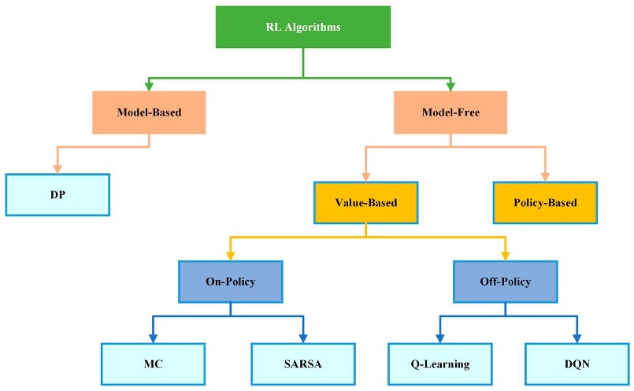

## Understanding Reinforcement Learning

:::: {.columns}

::: {.column width="50%"}

::: {.fragment .fade-in fragment-index=1}
1. Autonomous agents learn through **trial and error to make decisions** by interacting with their environment.
:::

::: {.fragment .fade-in fragment-index=2}
2. Utilize positive and negative feedback to **maximize cumulative rewards.**
:::

::: {.fragment .fade-in fragment-index=3}
3. Q-Learning
:::

:::

::: {.column width="50%"}
{width="100%"}
:::

::::

## Key Terms

:::: {.columns}

::: {.column width="50%"}

**Entities**

- Agent
- Environment

**Functions**

- Actions (*A*)
- State (*S*)
- Reward (*R*)
- Policy (off-policy)

:::

::: {.column width="50%"}
{width="100%"}
:::

::::

---

## &nbsp;

---

## {data-background-color="#ffffff"}

::: {style="text-align: center; padding-top: 50px;"}

{width="85%"}

:::

## Markov Decision Processes {.smaller}

::: {style="text-align: center; margin-top: 50px;"}
{width="60%"}
:::

## Bellman Equation

::: {style="text-align: center; margin-top: 40px; opacity: 0.5;"}

$$V(s) = \max_a [R(s, a) + \gamma V(s')]$$

:::

 

$Q(s,a)$ $=$ $R(s,a)$ $+$ $\gamma \max_a Q(s', a)$

How good it is to take action a in state s

Reward for taking that action at that state

Maximum possible Q-value in the next state

 

::: {style="text-align: center;"}

Discount rate parameter: $0 \leq \gamma \leq 1$

:::

## {data-background-image="images/q_learning.png" data-background-size="contain"}
## &nbsp;

:::: {.columns}

::: {.column width="55%"}

{width="100%"}

:::

::: {.column width="45%"}
::: {style="display: flex; align-items: center; height: 700px; justify-content: center;"}

actions

| **states** | $a_0$ | $a_1$ | $a_2$ | $\cdots$ |
|:---:|:---:|:---:|:---:|:---:|
| $S_0$ | $Q(s_0, a_0)$ | $Q(s_0, a_1)$ | $Q(s_0, a_2)$ | $\cdots$ |
| $S_1$ | $Q(s_1, a_0)$ | $Q(s_1, a_1)$ | $Q(s_1, a_2)$ | $\cdots$ |
| $S_2$ | $Q(s_2, a_0)$ | $Q(s_2, a_1)$ | $Q(s_2, a_2)$ | $\cdots$ |
| $\vdots$ | $\vdots$ | $\vdots$ | $\vdots$ | $\vdots$ |

:::
:::

::::

---

## {data-background-image="images/info1.jpg" data-background-size="contain"}

::: {.notes}
Need to learn without labeled data — In many real-world problems, there is no correct answer provided. The agent must learn from rewards or penalties instead of explicit supervision.
Need to handle sequential decision-making — Actions influence future states and future rewards. Decisions cannot be evaluated in isolation.
Need to operate in unknown or partially known environments — The agent does not have access to full transition dynamics. Learning must occur through interaction with the environment.
Need to balance exploration vs exploitation — The agent must try new actions (exploration) while using known good actions (exploitation). This trade-off is central to effective learning.
:::

## {data-background-image="images/info2.jpg" data-background-size="contain"}

::: {.notes}
Provides a framework for learning through interaction — Closely models how humans and animals learn from consequences. Connects with principles from psychology and neuroscience.
Enables autonomous decision-making systems — Systems can act, learn, and improve without explicit programming. Applicable to robotics, recommendation systems, and control systems.
Introduces foundational concepts in AI — Value functions (how good a state/action is), Policies (decision rules), Reward signals (objective of learning), Trial-and-error learning.
:::

## {data-background-image="images/applications.png" data-background-size="contain"}

## Methods {data-background-color="#ffffff"}

## Tutorial {data-background-color="#ffffff"}

## Results {data-background-color="#ffffff"}

## Discussion {data-background-color="#ffffff"}

## Conclusion {data-background-color="#ffffff"}
