## Understanding Reinforcement Learning

:::: {.columns}

::: {.column width="50%"}

<div style="margin-top: 200px; font-size: 1.3em;">

::: {.fragment .fade-in fragment-index=1}
1. Autonomous agents learn through **trial and error to make decisions** by interacting with their environment.
:::

::: {.fragment .fade-in fragment-index=2}
2. Utilize positive and negative feedback to **maximize cumulative rewards.**
:::

::: {.fragment .fade-in fragment-index=3}
3. Q-Learning
:::

</div>

:::

::: {.column width="50%"}
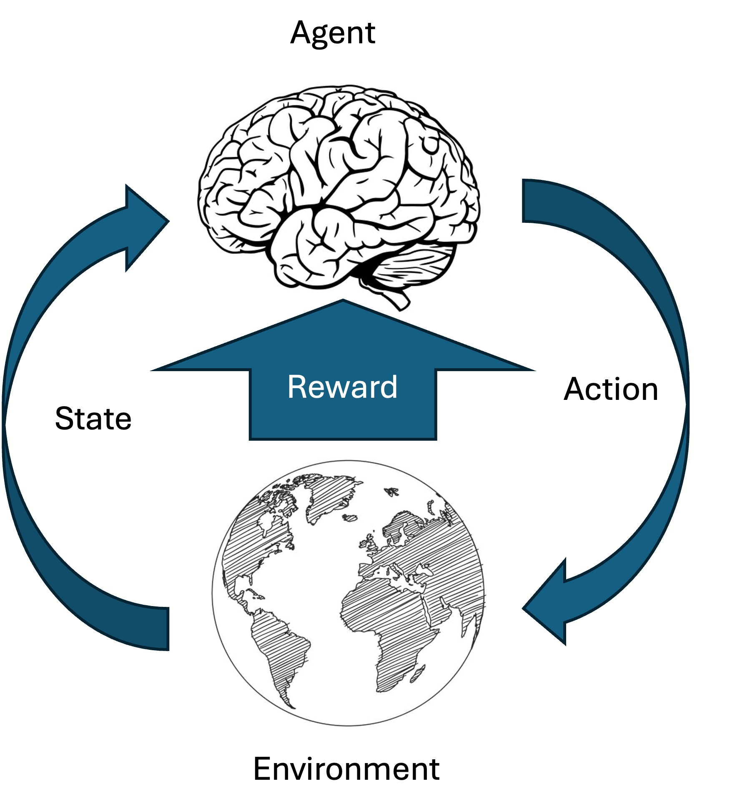{width="100%"}
:::

::::

## Key Terms

:::: {.columns}

::: {.column width="50%"}

<div style="margin-top: 100px; margin-left: 250px; font-size: 1.3em;">

**Entities**

- Agent
- Environment

**Functions**

- Actions (*A*)
- State (*S*)
- Reward (*R*)
- Policy (off-policy)

</div>

:::

::: {.column width="50%"}
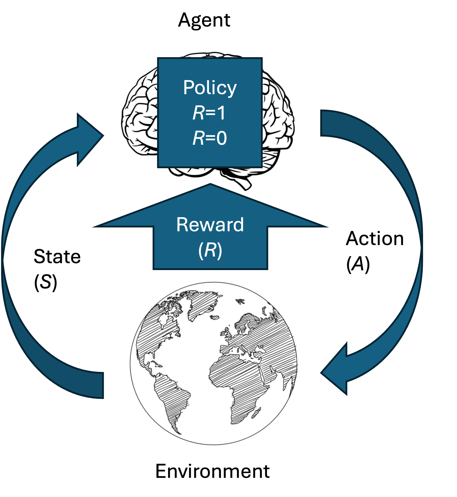{width="100%"}
:::

::::

---

## &nbsp;

<div style="position: relative; width: 100%; height: 100%;">
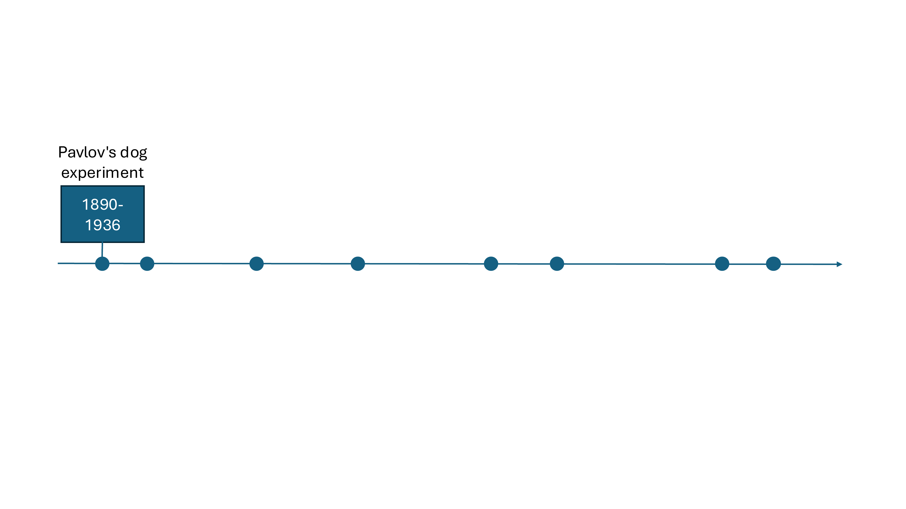
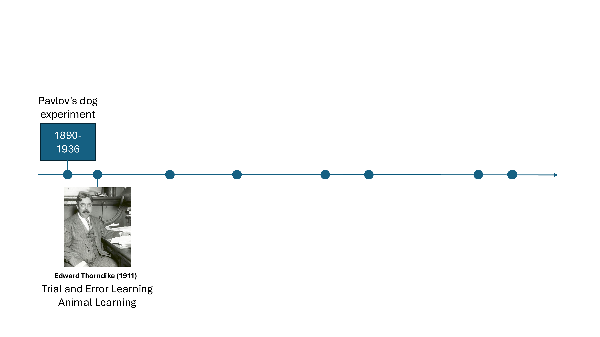
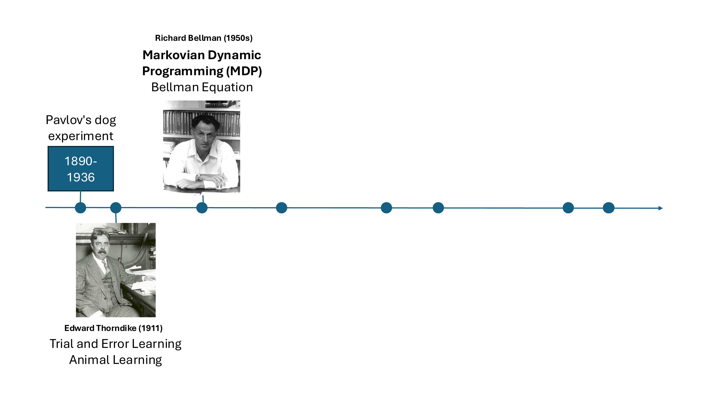
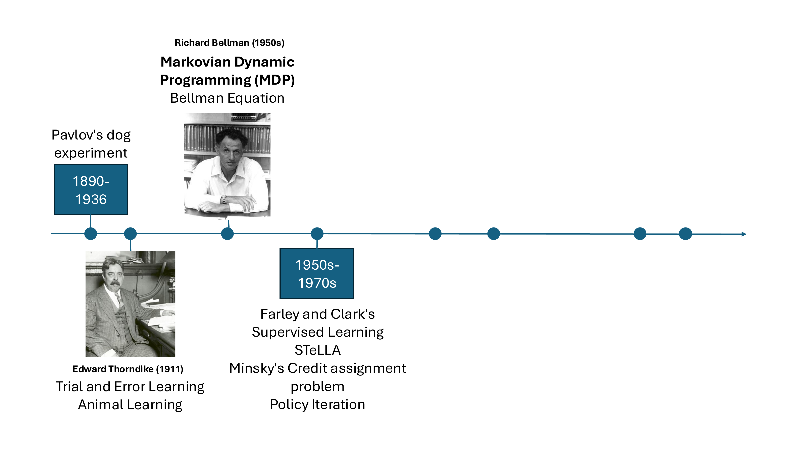
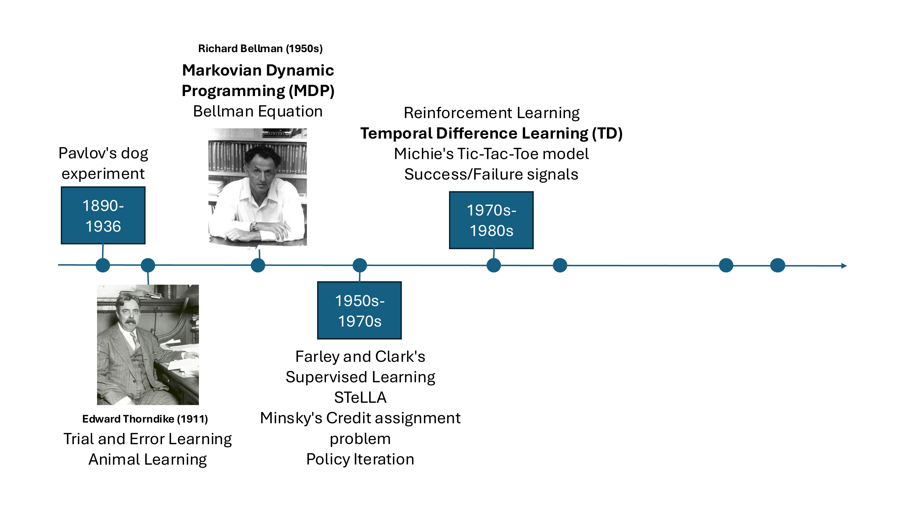
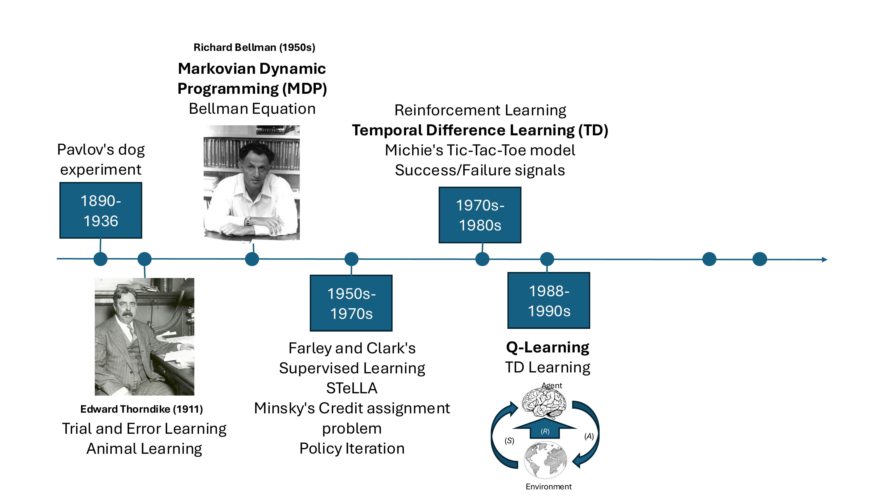
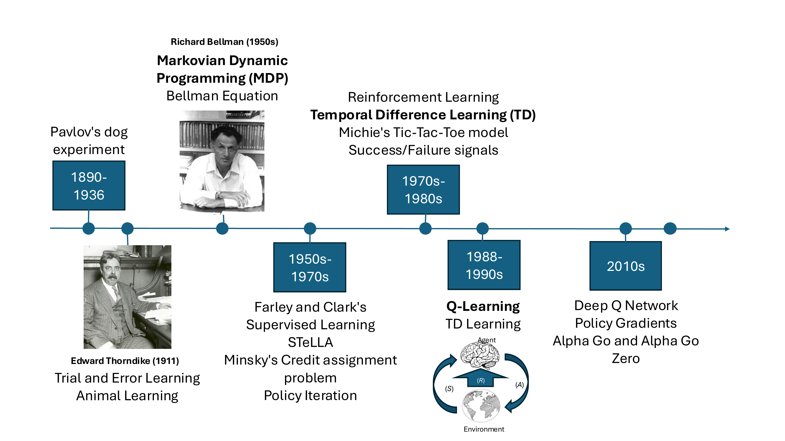
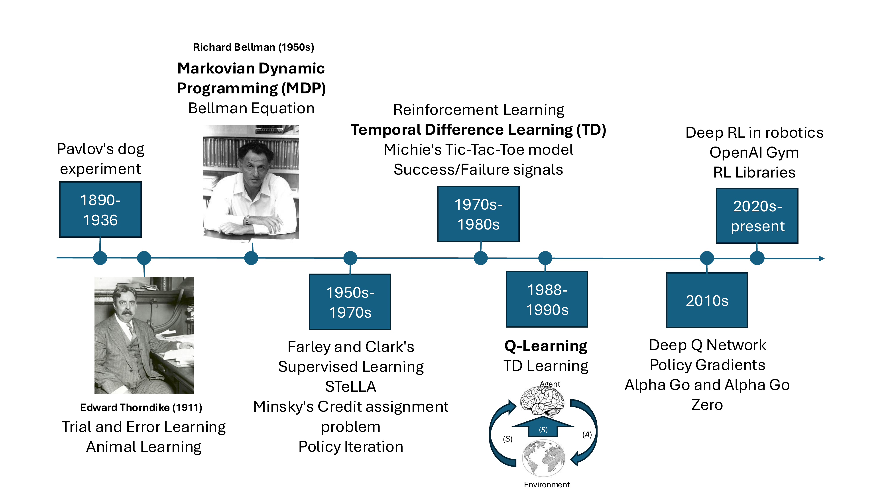
</div>
---

## {data-background-image="images/info1.jpg" data-background-size="contain"}

::: {.notes}
Need to learn without labeled data — In many real-world problems, there is no correct answer provided. The agent must learn from rewards or penalties instead of explicit supervision.
Need to handle sequential decision-making — Actions influence future states and future rewards. Decisions cannot be evaluated in isolation.
Need to operate in unknown or partially known environments — The agent does not have access to full transition dynamics. Learning must occur through interaction with the environment.
Need to balance exploration vs exploitation — The agent must try new actions (exploration) while using known good actions (exploitation). This trade-off is central to effective learning.
:::

## {data-background-image="images/info2.jpg" data-background-size="contain"}

## {data-background-image="images/applications.png" data-background-size="contain"}

::: {.notes}
Provides a framework for learning through interaction — Closely models how humans and animals learn from consequences. Connects with principles from psychology and neuroscience.
Enables autonomous decision-making systems — Systems can act, learn, and improve without explicit programming. Applicable to robotics, recommendation systems, and control systems.
Introduces foundational concepts in AI — Value functions (how good a state/action is), Policies (decision rules), Reward signals (objective of learning), Trial-and-error learning.
:::


## {data-background-color="#ffffff"}

::: {style="text-align: center; padding-top: 50px;"}

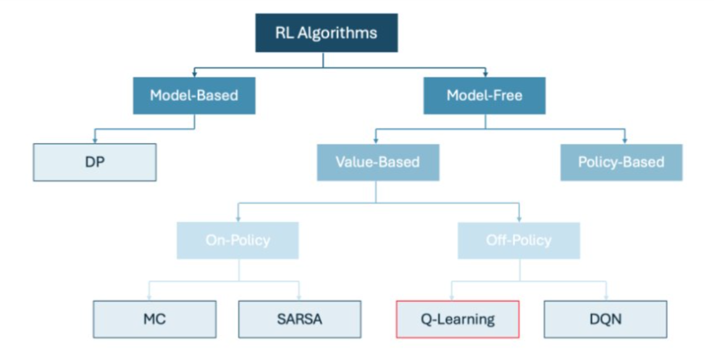{width="85%"}
:::


## Markov Decision Processes {.smaller}

::: {style="text-align: center; margin-top: 50px;"}
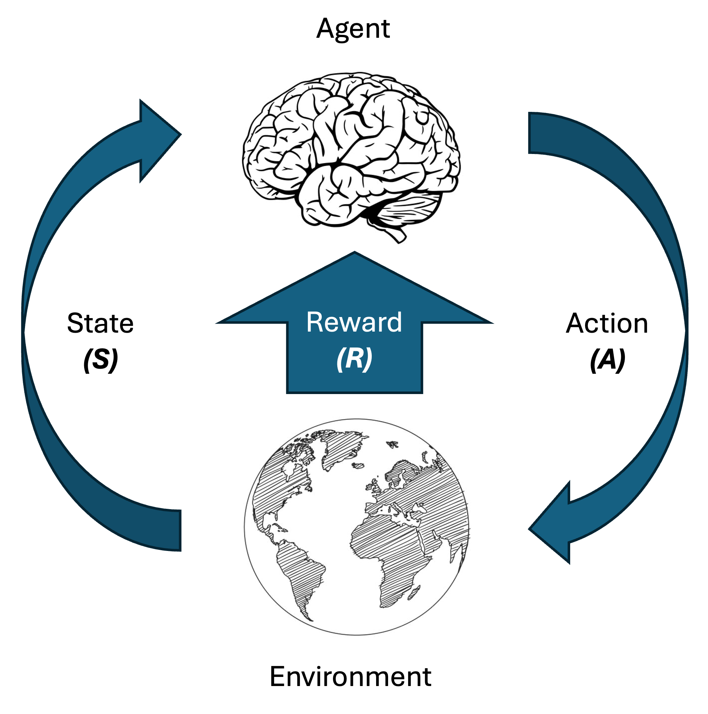{width="60%"}
:::

## Epsilon Greedy Strategy
::: {style="text-align: center; margin-top: 50px;"}
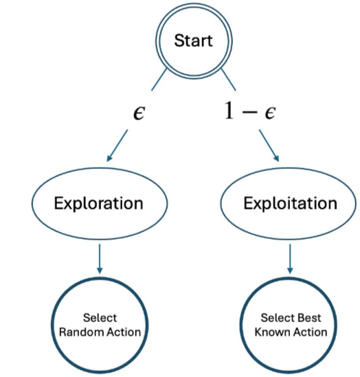{width="40%"}
:::

## Q-Learning
<br>
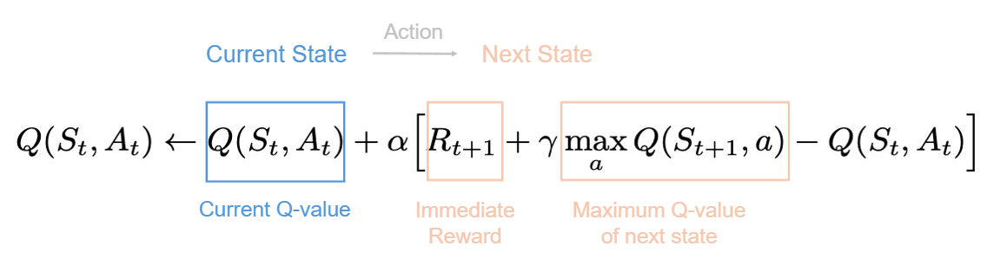

:::: {.columns}
::: {.column width="30%"}
:::

::: {.column width="50%"}
<br>
<br>
<br>
<br>
<br>
<br>
<br>
<br>
<br>
<br>
<br>
<br>

- Q-value: How good is this action in the given state​
:::
::::

## Q-Learning
<br>
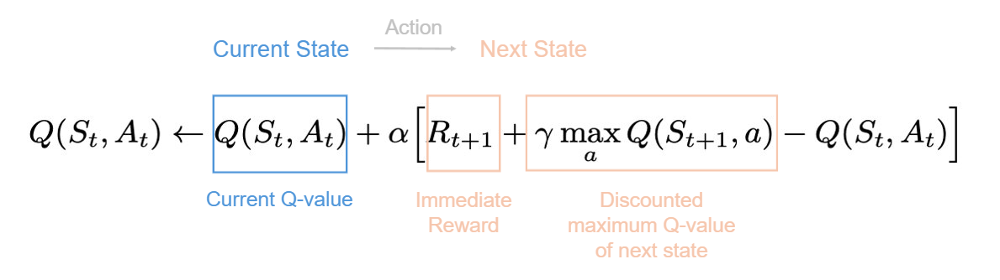

:::: {.columns}
::: {.column width="30%"}
:::

::: {.column width="50%"}
<br>
<br>
<br>
<br>
<br>
<br>
<br>
<br>
<br>
<br>
<br>
<br>

- Q-value: How good is this action in the given state​
- Discount Factor: 0 ≤ γ ≤ 1  
:::
::::

## Q-Learning
<br>
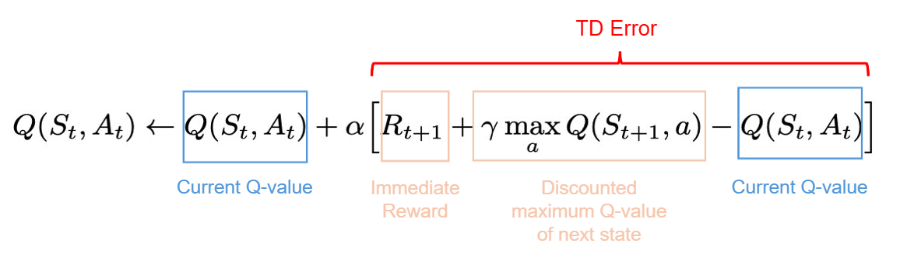

:::: {.columns}
::: {.column width="30%"}
:::

::: {.column width="50%"}
<br>
<br>
<br>
<br>
<br>
<br>
<br>
<br>
<br>
<br>
<br>
<br>

- Q-value: How good is this action in the given state​
- Discount Factor: 0 ≤ γ ≤ 1  
:::
::::

## Q-Learning
<br>
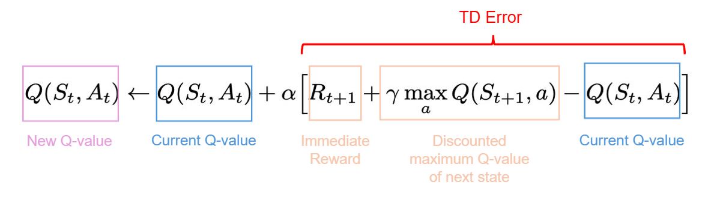

:::: {.columns}
::: {.column width="30%"}
:::

::: {.column width="50%"}
<br>
<br>
<br>
<br>
<br>
<br>
<br>
<br>
<br>
<br>
<br>
<br>

- Q-value: How good is this action in the given state​
- Discount Factor: 0 ≤ γ ≤ 1  
- Learning Rate: 0 ≤ α ≤ 1
:::
::::

## Q-Table

:::: {.columns}

::: {.column width="55%"}

<div style="margin-top: 100px;">
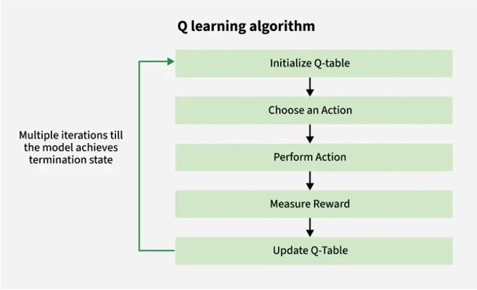{width="100%"}
</div>

:::

::: {.column width="45%"}
::: {style="display: flex; align-items: center; height: 700px; justify-content: center;"}

<div style="font-size: 1.2 em; width: 100%;">

<div style="text-align: center; font-weight: bold; font-size: 0.2 em; margin-bottom: 5px;">actions</div>

| **states** | $a_0$ | $a_1$ | $a_2$ | $\cdots$ |
|:---:|:---:|:---:|:---:|:---:|
| $S_0$ | $Q(s_0, a_0)$ | $Q(s_0, a_1)$ | $Q(s_0, a_2)$ | $\cdots$ |
| $S_1$ | $Q(s_1, a_0)$ | $Q(s_1, a_1)$ | $Q(s_1, a_2)$ | $\cdots$ |
| $S_2$ | $Q(s_2, a_0)$ | $Q(s_2, a_1)$ | $Q(s_2, a_2)$ | $\cdots$ |
| $\vdots$ | $\vdots$ | $\vdots$ | $\vdots$ | $\vdots$ |

</div>

:::
:::

::::

---

## Tutorial: Maze Setup
```{.python code-line-numbers="|9-16|4-7"}
import numpy as np
import matplotlib.pyplot as plt

# 0 = free cell
# 1 = wall
# 2 = hole (terminal, negative reward)
# 3 = goal (terminal, positive reward)

maze = np.array([
    [0, 0, 1, 0, 0, 0],
    [0, 2, 0, 0, 1, 0],
    [0, 0, 0, 2, 0, 0],
    [0, 1, 1, 0, 1, 0],
    [0, 0, 0, 0, 0, 0],
    [2, 0, 1, 0, 0, 3]
])

ROWS, COLS = maze.shape
START = (0, 0)
GOAL  = (5, 5)
```

## Tutorial: Initialize Q-Table & Parameters
```{.python code-line-numbers="|1-2|4-5"}
# shape: (rows, cols, 4 actions)
Q = np.zeros((ROWS, COLS, 4))

# action directions: 0=up, 1=down, 2=left, 3=right
DIRS = [(-1,0), (1,0), (0,-1), (0,1)]

alpha   = 0.5   # learning rate
gamma   = 0.9   # discount factor
epsilon = 0.2   # exploration rate
episodes = 500
```

## Tutorial: Step Function
```{.python code-line-numbers="|2-4|5|7-9|12|13-20"}

def step(state, action):
    r, c = state
    dr, dc = DIRS[action]
    nr, nc = r + dr, c + dc

    # if move goes out of bounds or into wall, stay still
    if nr < 0 or nr >= ROWS or nc < 0 or nc >= COLS or maze[nr, nc] == 1:
        nr, nc = r, c

    # assign reward based on what the next cell is
    tile = maze[nr, nc]
    if tile == 3:
        reward = 10       # reached goal
    elif tile == 2:
        reward = -1       # fell in a hole
    else:
        reward = -0.04    # small penalty to encourage efficiency

    done = (tile == 3 or tile == 2)
    return (nr, nc), reward, done
```

## Tutorial: Choose Action Function
```{.python code-line-numbers="|3-4|5-6"}
def choose_action(state):
    r, c = state
    if np.random.random() < epsilon:
        return np.random.randint(4)           # random action
    else:
        return np.argmax(Q[r, c])             # best known action
```

## Tutorial: Training Loop
```{.python code-line-numbers="|4-6|11-13|15-16|18-21|22-26"}
steps_per_episode = []
deltas_over_time  = []

for episode in range(episodes):
    state = START
    steps = 0

    while True:
        r, c = state

        action = choose_action(state)
        next_state, reward, done = step(state, action)
        nr, nc = next_state

        # compute TD error
        delta = reward + gamma * np.max(Q[nr, nc]) - Q[r, c, action]

        # update Q table
        Q[r, c, action] += alpha * delta

        deltas_over_time.append(delta)
        steps += 1
        state = next_state

        if done or steps > 500:
            break

    steps_per_episode.append(steps)
```

## Results: Number of Steps Taken and TD error over time

::: {style="text-align: center;"}
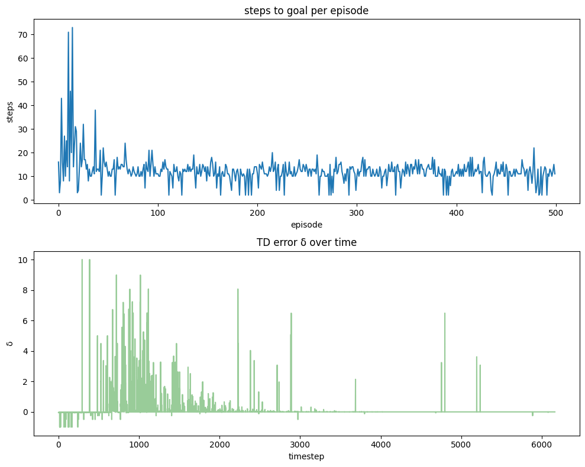{width="65%"}
:::

## Results: Final Q-Table and Learned Policy

::: {style="text-align: center;"}
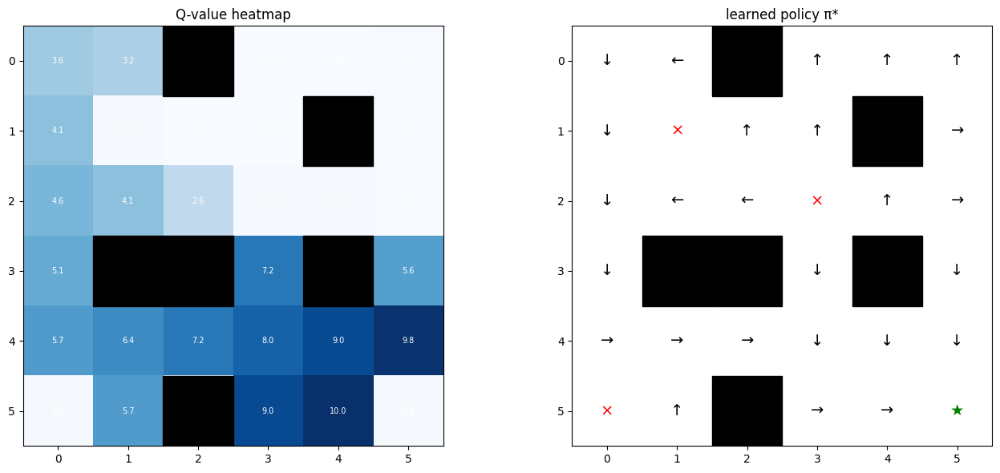{width="100%"}
:::

## Application: D1/D2 Receptors 

::: {style="text-align: center;"}
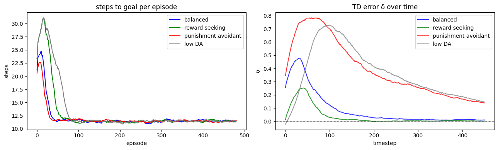{width=80%}
:::

::: {style="text-align: center;"}
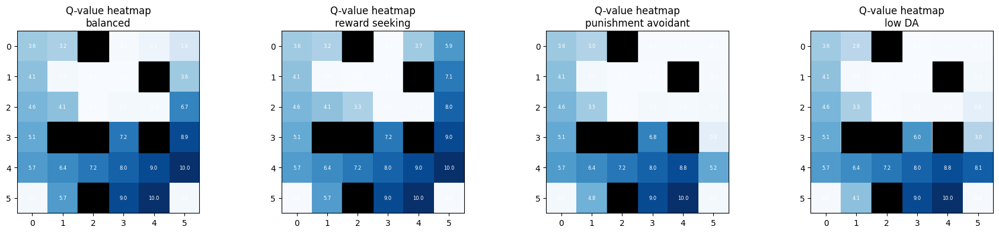{width=80%}
:::

## Libraries: Gymnasium

:::: {.columns}

::: {.column width="50%"}

**Python library for developing and comparing RL algorithms**

- Pre-built environments 
- Same interface for every environment: `reset()`, `step()`, `render()`
- Same algorithm across environments without modification
```python
import gymnasium as gym

env = gym.make("LunarLander-v2")
state, info = env.reset()

action = env.action_space.sample()
state, reward, terminated, truncated, info = env.step(action)
```

:::

::: {.column width="50%"}
::: {style="text-align: center; margin-top: 40px;"}
{width=90%}
:::
:::

::::

## Libraries: Stable Baselines3 - DQN

:::: {.columns}

::: {.column width="50%"}

**Neural network instead of Q-table**

- Same TD error algorithm but Q-table replaced by a neural network
- Allows the same algorithm to scale to environments with continuous or very large state spaces

```python
from stable_baselines3 import DQN
import gymnasium as gym

env   = gym.make("CartPole-v1")
model = DQN("MlpPolicy", env, verbose=1, gamma=0.99)
model.learn(total_timesteps=100_000)
```

:::

::: {.column width="50%"}
::: {style="text-align: center; margin-top: 150px;"}
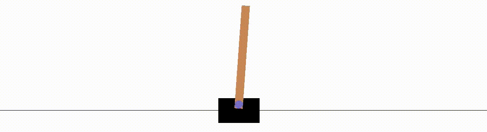{width=90%}
:::
:::

::::

---

## Libraries: NeuroGym - RL on Cognitive Tasks

:::: {.columns}

::: {.column width="50%"}

**RL framework in cognitive tasks**

- Example: Go/No-Go task — a cognitive neuroscience task
- Agent sees a stimulus and must decide whether to respond or withhold
- Trained agent behaviour can be compared directly to neural recordings

```python
import neurogym as ngym

env = ngym.make('GoNogo-v0', dt=100)
env = env.unwrapped
fig = ngym.utils.plot_env(env, num_trials=3)
```

:::

::: {.column width="50%"}
::: {style="text-align: center; margin-top: 40px;"}
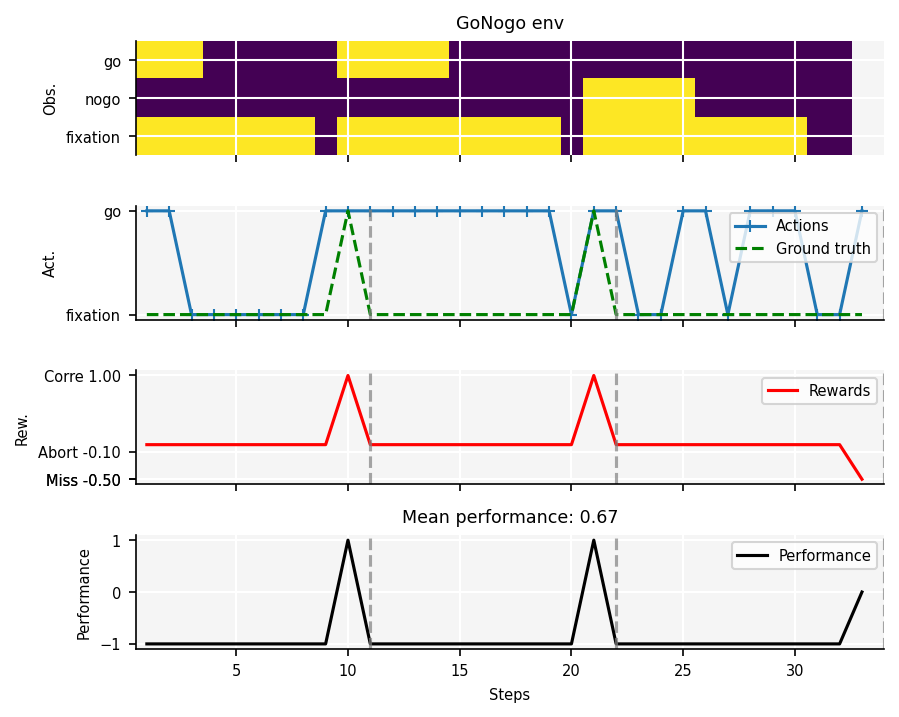{width=90%}
:::
:::

::::


## {data-background-color="#1a3a4a"}

::: {style="display: flex; flex-direction: column; align-items: center; justify-content: center; height: 80vh; color: white; text-align: center;"}
<div style="font-size: 2.5em; font-weight: 600; margin-bottom: 0.3em;">Thank You</div>
<div style="font-size: 1.5em; opacity: 0.7;">Questions?</div>
:::